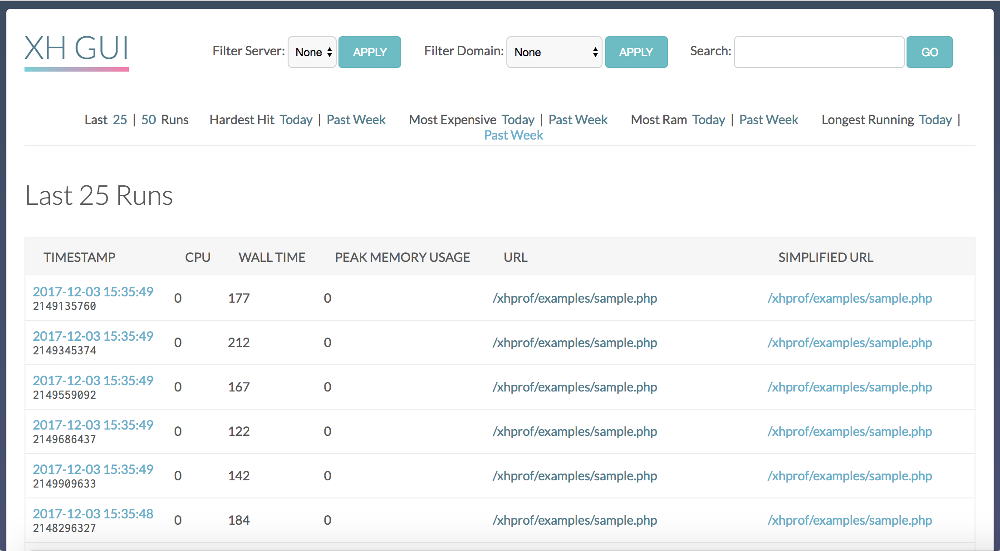
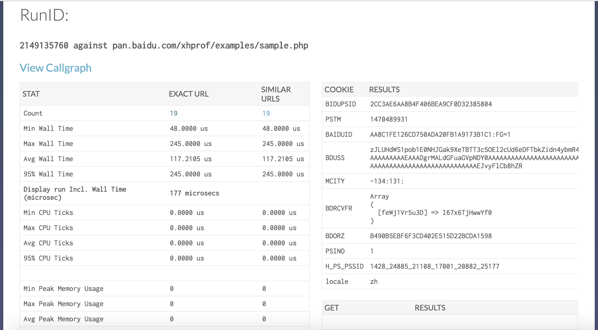
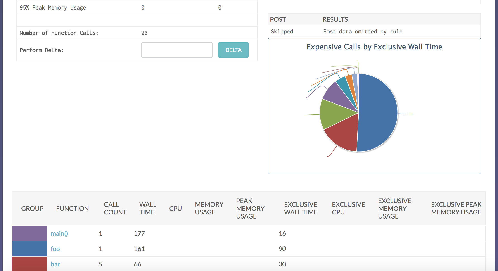
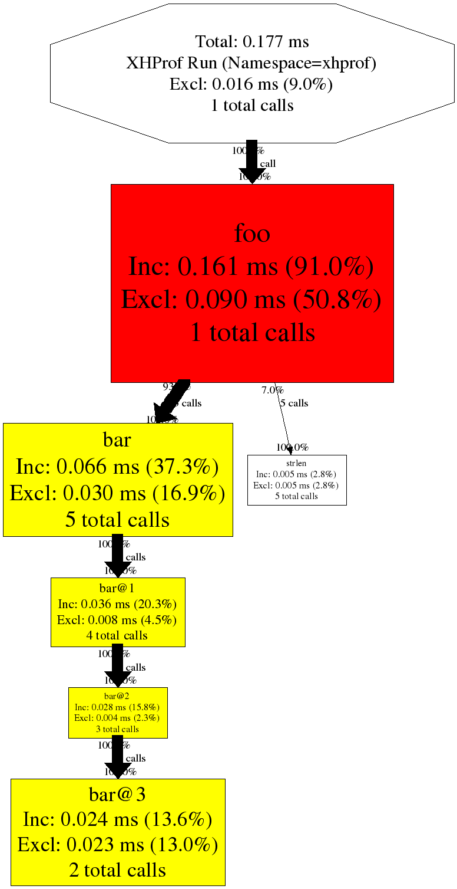

XHProf UI
=========

XHProf UI是个图形前端，用以展示Google公司开源的XHProf性能分析工具收集的数据; 
* 原文来源[xhprof ui](https://github.com/preinheimer/xhprof);

类似工具
-------------

* [XHGui](https://github.com/perftools/xhgui) - 使用 MongoDB 作为后端存储

主要功能
-------------

* 默认显示最近25，50条请求性能信息（可以定制）
* 当天cpu使用最高，内存使用最高，响应时间最长排序
* 支持域名、URI等多个维度的数据索引
* 函数调用记录完整，内核级别函数调用情况
* 调用关系动态图
* 支持按请求百分比执行xhprof优化。降低服务器负载
* 友好的界面
* 数据库存储（mysql）

依赖
------------

除了能运行php的web服务环境外，还需要一下环境：

* `php5-xhprof` ：函数调用性能数据获取php扩展；
* `php5-mysql` ：`mysql`客户端php扩展；
* `mysql` ：`mysql`服务端；版本建议使用5.3以下，不要使用`mysql5.6` 会报` Incorrect integer value: '' for column 'cpu' at row 1`错误，如果实在要用，请把表结构中的`int`字段都改成`varchar`；
* `graphviz` ：使用 `dot` 生成调用关系动态图 `libpng`)；

Installation
-------------
> 依赖环境 (以mac为例)

* 安装运行php的web服务环境；安装php扩展`xhprof.so`, `mysql.so`，并配置好`php.ini`；
```angularjs
brew install php5-xhprof php5-mysql
```
修改php.ini
```angularjs
[xhprof]
extension=xhprof.so
[mysql]
extension=mysql.so
```
* 安装 `MySQL server`；
```angularjs
brew install mysql
mysql.server restart
```
* 安装`graphviz`；执行 `dot --help`可用；
```angularjs
brew install graphviz
dot --help
```
* 克隆该仓库到web服务器的工作目录；
```angularjs
git clone https://github.com/echoOly/xhprof.git
```
* 确保目录`xhprof_html`能通过`http`访问，并且配置web服务器使`xhprof_html`下的`css,js`可以被访问；
```angularjs
location ~ \.(css|js)$ {
    root  /home/www/;
}
```
> 项目配置
* 移动 `xhprof_lib/config.sample.php` 为 `xhprof_lib/config.php`
```angularjs
mv xhprof_lib/config.sample.php xhprof_lib/config.php
```
* 根据实际情况配置 `xhprof_lib/config.php`

```angularjs
$_xhprof = array();

// Change these:
$_xhprof['dbtype']     = 'mysql';      // 数据库类型
$_xhprof['dbhost']     = 'localhost';  // 数据库host
$_xhprof['dbuser']     = 'root';       // 数据库用户名
$_xhprof['dbpass']     = 'root';       // 数据库密码
$_xhprof['dbname']     = 'xhprof';     // 数据库名称
$_xhprof['dbadapter']  = 'Mysql';      // 驱动的方式 会掉起utils/db/下对于的数据库类
$_xhprof['servername'] = 'servername'; // 服务名称
$_xhprof['namespace']  = 'myapp';
$_xhprof['url']        = 'http://127.0.0.1/xhprof/xhprof_html'; // ui网站的访问地址
$_xhprof['getparam']   = "_profile"; // 在监控的接口增加参数&_profile=1，会在原始接口中吐出性能监控的采样数据

$_xhprof['serializer'] = 'php'; // 数据库中get post序列化方式 支持json php序列化

// 生成调用关系图 安装`graphviz`后dot的配置
$_xhprof['dot_binary']  = '/usr/bin/dot';
$_xhprof['dot_tempdir'] = '/tmp';
$_xhprof['dot_errfile'] = '/tmp/xh_dot.err';

// 下面配置只要请求链接中包含都会过滤
$ignoreURLs = array();        // 黑名单，即忽略的url
$ignoreDomains = array();     // 忽略的Domains
$exceptionURLs = array();     // 底部不显示性能采样的地址的接口
$exceptionPostURLs = array(); // 不保存post的
$exceptionPostURLs[] = "login";

$_xhprof['display']   = false; // 是否在接口底部显示性能采样的地址
$_xhprof['doprofile'] = false; // 默认要不要开始性能监控，都会走上面过滤策略修改赋值
$_xhprof['show_cpu']  = false; // 是否采样cpu信息 默认不开
$_xhprof['show_mem']  = false; // 是否采样内存信息 默认不开

// false 不对客户端亲请求ip限制， true时只对白名单中的进行数据采样
$controlIPs = false; 
// 采样ip白名单
//$controlIPs = array();
//$controlIPs[] = "127.0.0.1";   // localhost, you'll want to add your own ip here
//$controlIPs[] = "::1";         // localhost IP v6

//$otherURLS = array();

// 可忽略的采样方法
//$ignoredFunctions = array('call_user_func', 'call_user_func_array', 'socket_select');

// 采样概率 1%$weight 采样 优先取环境变量中`xhprof_weight`得值
$weight = 100;

if($domain_weight = getenv('xhprof_weight')) {
	$weight = $domain_weight;
}

```

> 使用方式
* 创建数据库 并导入表结构：
如果使用`mysql5.6` 会报` Incorrect integer value: '' for column 'cpu' at row 1`错误，请把表结构中的`int`字段都改成`varchar`；
```
 CREATE TABLE `details` (
 `id` char(17) NOT NULL,
 `url` varchar(255) default NULL,
 `c_url` varchar(255) default NULL,
 `timestamp` timestamp NOT NULL default CURRENT_TIMESTAMP on update CURRENT_TIMESTAMP,
 `server name` varchar(64) default NULL,
 `perfdata` MEDIUMBLOB,
 `type` tinyint(4) default NULL,
 `cookie` BLOB,
 `post` BLOB,
 `get` BLOB,
 `pmu` int(11) unsigned default NULL,
 `wt` int(11) unsigned default NULL,
 `cpu` int(11) unsigned default NULL,
 `server_id` varchar(32) NOT NULL default 't11',
 `aggregateCalls_include` varchar(255) DEFAULT NULL,
 PRIMARY KEY  (`id`),
 KEY `url` (`url`),
 KEY `c_url` (`c_url`),
 KEY `cpu` (`cpu`),
 KEY `wt` (`wt`),                                                                                                                                      
 KEY `pmu` (`pmu`),
 KEY `timestamp` (`timestamp`)
 ) ENGINE=innodb DEFAULT CHARSET=utf8;
```
* 引入监控入口文件 `xhprof/external/header.php`
    * 在需要监控的项目的`index.php`，直接引入：
    ```
    require_once 'xhprof/external/header.php';
    ```
    * `php`| `Nginx`配置`php`模块启动就加载；以`php`为例，修改`php.ini`:
    ```angularjs
    auto_prepend_file=/var/www/xhprof/external/header.php
    ```
* 访问采样数据，请求`/xhprof/xhprof_html/index.php`
效果图：
    * 首页列表 
    * 调用详细1 
    * 调用详细2 
    * 调用关系图 
